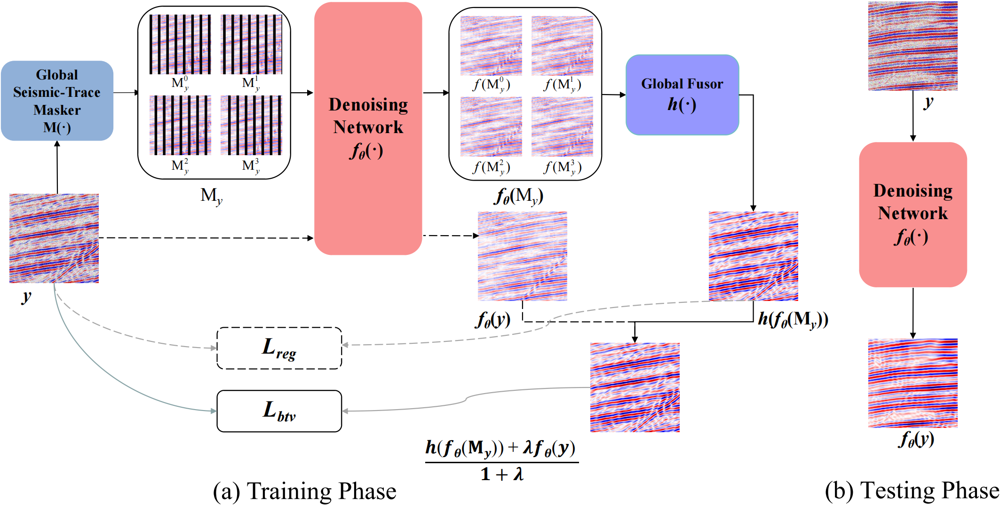
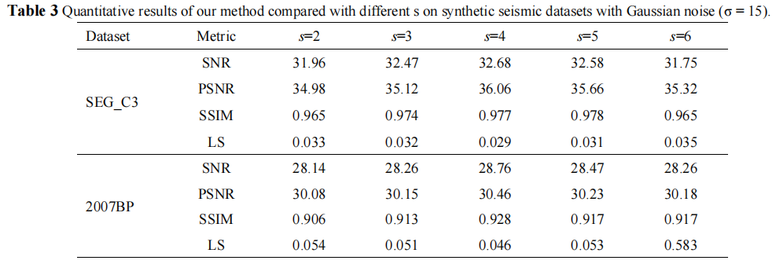
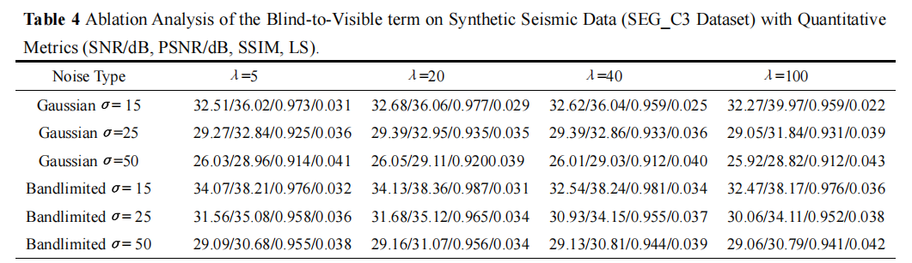
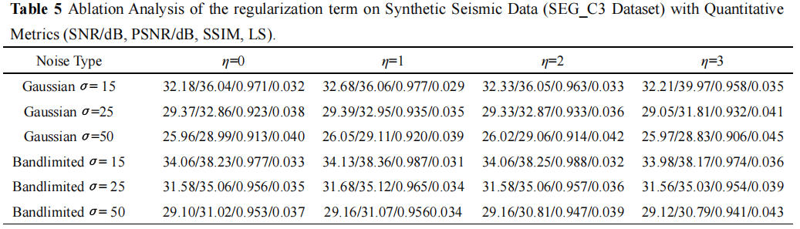
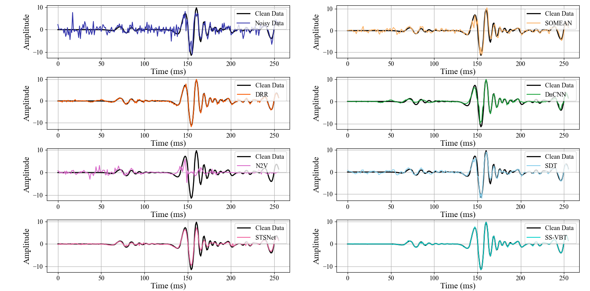

# SS-VBT


## Installation
The model is built in Python3.8.5, PyTorch 1.12.1 in Ubuntu 18.04 environment.

## Data Preparation

### 1. Prepare Training Dataset

Please put your dataset under the path: **./SS-VBT/data/train**.


### 2. Prepare Validation Dataset

​	Please put your dataset under the path: **./SS-VBT/data/validation**.

## Pretrained Models

The pre-trained models are placed in the folder: **./SS-VBT/pretrained_models**

```yaml
# # For synthetic denoising
# gauss25
./pretrained_models/g25.pth

# # For field data denoising
./pretrained_models/Field.pth


## Train
* Train on synthetic dataset
```shell
python train_ssvbt.py --noisetype gauss25 --data_dir ./data/train/Imagenet_val --val_dirs ./data/validation --save_model_path ../experiments/results --log_name b2u_unet_gauss25_112rf20 --Lambda1 1.0 --Lambda2 2.0 --increase_ratio 20.0
```
## Test

* Test on **SEG_C3,BP2007**

  * For noisetype: gauss15

    ```shell
    python test_ssvbt.py --noisetype gauss15 --checkpoint ./pretrained_models/g15.pth --test_dirs ./data/validation --save_test_path ./test --log_name b2u_unet_g15_112rf20 --beta 19.7
    ```
 * For noisetype: gauss25

    ```shell
    python test_ssvbt.py --noisetype gauss25 --checkpoint ./pretrained_models/g25.pth --test_dirs ./data/validation --save_test_path ./test --log_name b2u_unet_g25_112rf20 --beta 19.7
    ```
* For noisetype: gauss50

    ```shell
    python test_ssvbt.py --noisetype gauss50 --checkpoint ./pretrained_models/g50.pth --test_dirs ./data/validation --save_test_path ./test --log_name b2u_unet_g50_112rf20 --beta 19.7
    ```

* Test on **Mobil Viking Graben Line 12 dataset**

  *  For Confocal_FISH

    ```shell
    python test_ssvbt.py --checkpoint ./pretrained_models/Field.pth --test_dirs ./dataset/FieldData --subfold Confocal_FISH --save_test_path ./test --log_name Confocal_FISH_b2u_unet_FIELD_112rf20 --beta 20.0
    ```
### Self-Supervised Visible Blind Trace Framework


### Test Results
#### 1. Experimental results under Gaussian noise and on SEG_C3 and BP2007


#### 2. Experimental results under Bandlimited noise and on SEG_C3 and BP2007


#### 3. Influences of Masking Strategies


#### 4. Influences of Blind-to-Visible Term


#### 5. Influences of Regularization Term

#### 6. Visual results of SEG_C3


#### 8. Visual results of BP2007


#### 9. Visual results of single trace


#### 10. Visual results of Mobil Viking Graben Line 12



 
